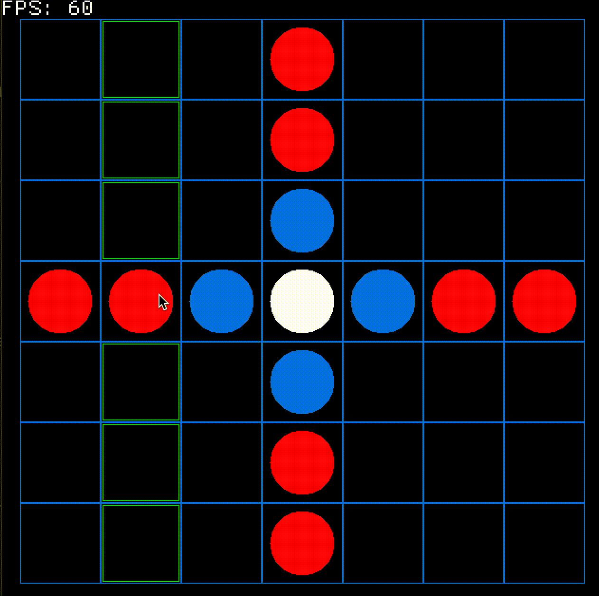

# tafl

talf written in rust, using the brandub board and rule set

[macroquad](https://github.com/not-fl3/macroquad) is used to do graphics

## To run
use `cargo run --release` as it is much faster for the ai's turn

## Features
Current
- Can play against ai
- Graphical display of board
- multi core usage to speed up ai
- build for web
- Parameterized Depth (for selecting difficulty) (available but no ui for it)

Possible Future Features
- Better Graphics
- Monte Carlo AI
- tracking how many states were visited for ai comparison

## Rules
Taken and modified from http://tafl.cyningstan.com/page/171/brandub
1. Brandub is played on a board of 7×7 squares, with the central square and the corner squares marked.

2. There are thirteen pieces: a king and his four defenders, and eight attackers. These are placed in the shape of a cross, as in the diagram.

3. The attacking side takes the first move.

4. Pieces move any distance orthogonally, not landing on nor jumping over other pieces on the board.

5. No piece may land on the central square, not even the king once he has left it. Only the king may land on the corner squares.

6. A piece other than the king is captured when it is surrounded orthogonally on two opposite squares by enemies. The king can take part in captures in partnership with a defender.

7. A piece may also be captured between an enemy and the empty central square or a corner square.

8. When in the central square, the king is captured by surrounding him on four orthogonal sides with attackers.

9. When standing beside the central square, the king may be captured by surrounding him on the remaining three sides with attackers.

10. Elsewhere on the board, the king is captured as other pieces.

11. The king wins the game on reaching any of the marked corner squares. The attackers win if they capture the king.

## Sample play

## AI

The current AI is using minimax with alpha beta pruning. It is set to look 4 moves past the current turn.

The current evaluation function benefits having more pieces and having those pieces spread out over the board.
